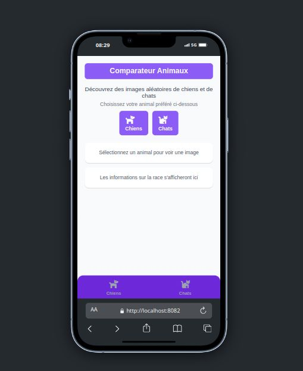
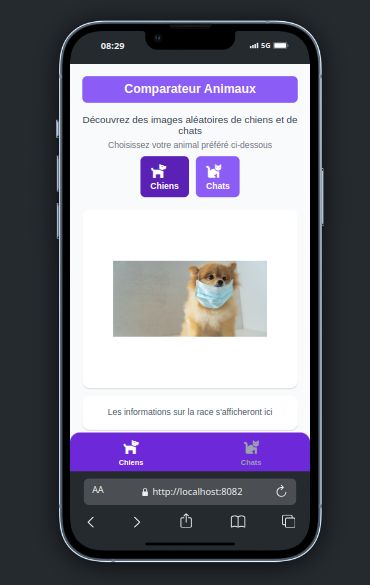
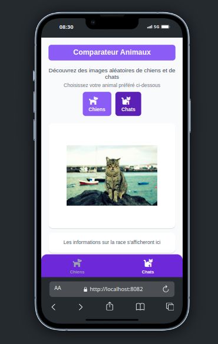

# Comparateur animaux - Galerie chiens vs chats

### NB:
installer une extension vue mobile sur google chrome pour avoir le meuilleur experience 
par exemple j'utilise l'exetension du chrome
Nom de l'extension : Simulateur téléphone mobile - test site responsive

## Initialisation

1. Install dependencies

   ```bash
   npm install
   ```

2. Start the app

   ```bash
   npx expo start --web

## Capture de mon projet examen




